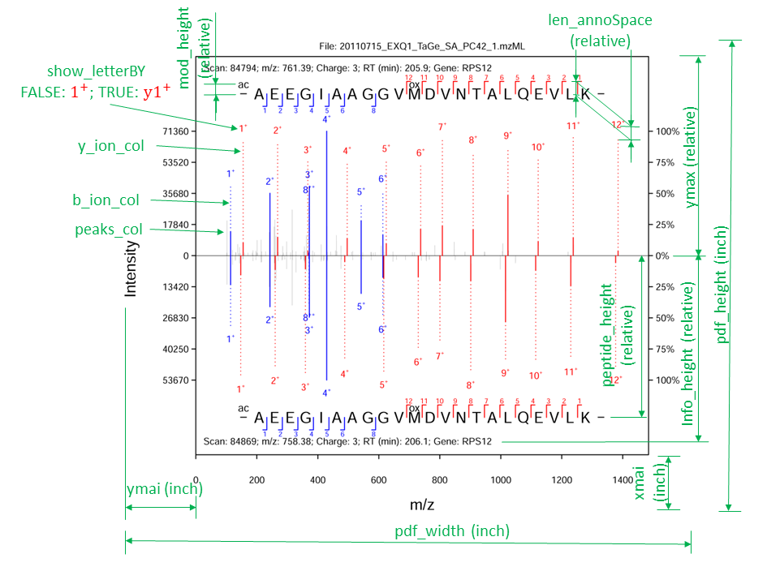

```{r setup, include = FALSE}
knitr::opts_chunk$set(
    collapse = TRUE,
    comment = "#>"
)
```

The package mms2plot visualizes multiple tandem mass spectrometry (MSs) for 
modificated and non-modified peptides identified from the same raw MS files, 
annotated by peptide identification algorithms (e.g. Maxquant). It will output 
a mirror-style plot for two PSMs and a aligned plot for more than two PSMs. Using
these plots, users can evaulate these PSMs. The output is set in PDF format and 
the output file width is recommended as 3.35 inch (single column) or 7 inch 
(double column). 

The input files for mms2plot are referred to as two Maxquant parameter files 
(i.e. parameters.xml and mqpar.xml) and one maxquant output file (msms.txt). 
The input/output files of other search engines than Maxquant are easily 
converted to the maxquant styles and as the input files for mms2plot. 


## Input files

The package mms2plot requires three input files: id_table_path, mod_xml_path,
par_filepath, where are introduced below. 

## id_table_path
The id_table_path contains seven essential columns. The first six columns are 
based on Maxquant output file "msms.txt" while the last column "label" is 
manually added by users. As for the database search results based on other 
search engines, users can generate the id_table_path according to the following 
format. Additional columns in id_table_path are omitted. 
```{r, echo=TRUE, results='asis'}
getwd()
id_table_path = "../inst/extdata/silac/msms_SILAC.txt"
input_table <- data.table::fread(id_table_path, na.strings = "NA",
        sep = "\t", fill = TRUE, header = TRUE)
knitr::kable(input_table)
```

## mod_xml_path
The mod_xml_path is the Maxquant parameter file modifications.xml.

## par_filepath
par_filepath includes a list of Maxquant parameter files mqpar.xml with full
file path as well as ppm cutoffs. Users can generate the par_filepath 
according to the following example.
```{r, echo=TRUE, results='asis'}
getwd()
par_filepath = "../inst/extdata/par_batch.txt"
par_files<-data.table::fread(par_filepath, na.strings = "NA",
        sep = "\t", fill = TRUE, header = TRUE)
knitr::kable(par_files)
```

## Input parameters
Users can adjust the output plot by changing input parameters in the function
mms2plot(). The meanings of the parameters are illustrated in the following  
image. Some of the parameters are measured in inch while others are set relative
to 1.
```{r pressure, echo=FALSE, fig.cap="", out.width = '100%'}

```

> [Package mms2plot version 0.1.0 [Index](https://github.com/lileime/mms2plot)]


